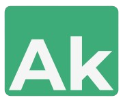

<h1 align="center">
  <div align="center">
    
  </div>
  <br/>
  Portfolio - Amir-khan Bili
</h1>
<p align="center">
    My personal portfolio built with Next.js.
    <br />
    Cloned from Amird3vs' <a href="https://github.com/Amird3vs/portfolio">portfolio</a> project.
    <br />
    Inspired on dnachavez's <a href="https://github.com/dnachavez/portfolio">portfolio</a> project.
    <br />
    <a href="https://amirdevs.vercel.app/" target="_blank">Go to website</a>&nbsp;
    ·
    &nbsp;<a href="https://github.com/Amird3vs/portfolio/issues">Report Bug</a>
  </p>
<br/>

## Built With 🚀

This project was built using these technologies:

- Next.js
- Aceternity UI

## Features

- 🚀 A great web performance
- 📱 Fully Responsive
- ☀️ Light and Dark Theme

## Getting Started

To get a local copy up and running, follow these steps:

Clone down this repository. You will need `node.js` and `git` installed globally on your machine.

### Installation and Setup Instructions 🛠

1. In the project directory, run:

```
npm install
```

2. After, you can run:

```
npm run dev
```

This runs the app in the development mode.
Open [http://localhost:3000](http://localhost:3000) to view it in the browser.

### Show your support

Give a ⭐ if you like this website. Thanks!
